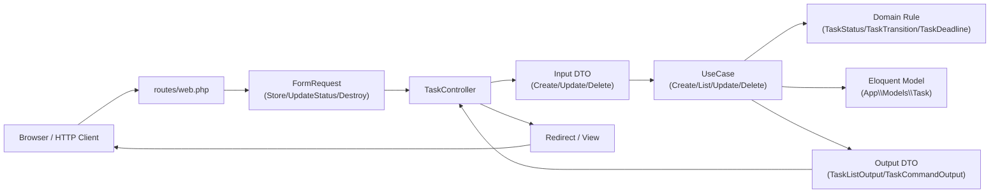
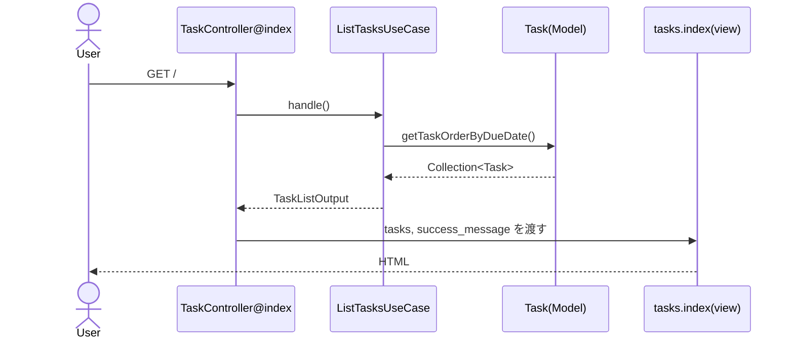
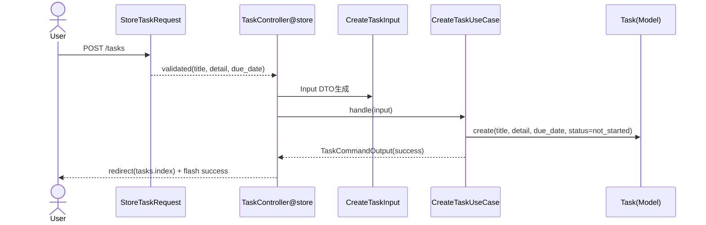
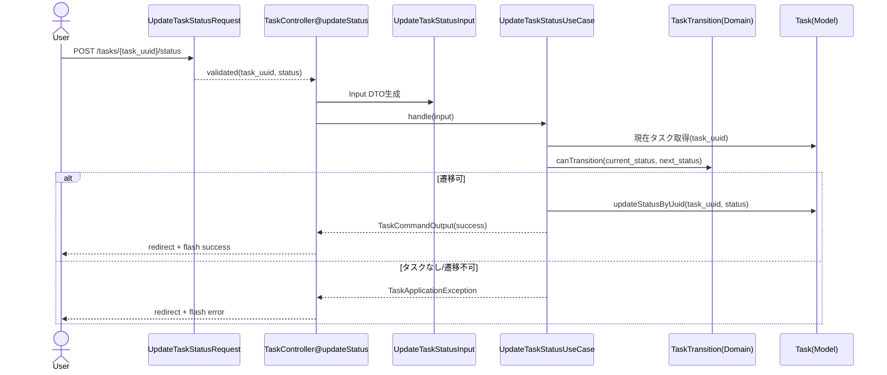
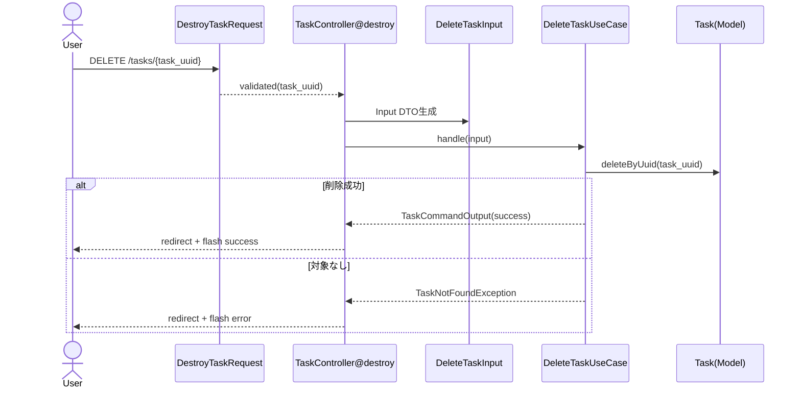

# Task機能 データフロー図（UseCase版）

このドキュメントは、Task機能の現在実装におけるデータの流れを可視化するためのものです。  
GitHub上で確認しやすいように、`mermaid` で記載しています。

---

## 1. 全体レイヤーフロー

---

## 2. 一覧（GET `/`）

---

## 3. 作成（POST `/tasks`）

---

## 4. ステータス更新（POST `/tasks/{task_uuid}/status`）

---

## 5. 削除（DELETE `/tasks/{task_uuid}`）

