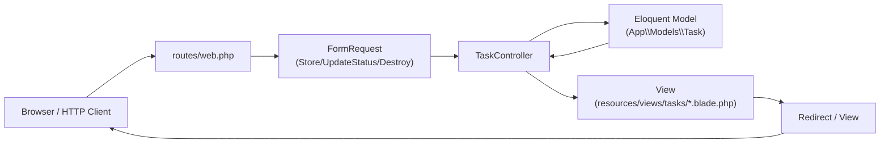
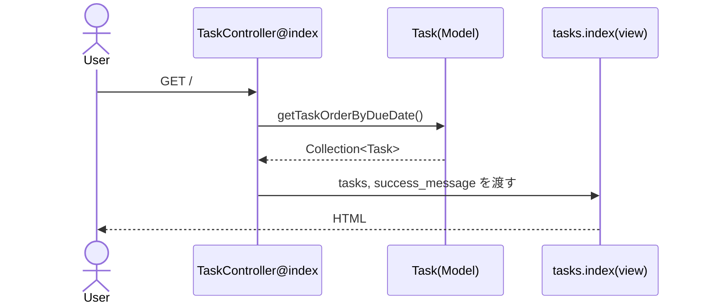
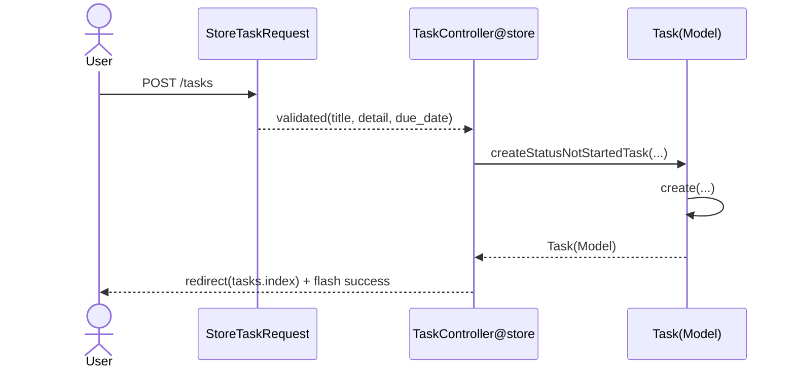
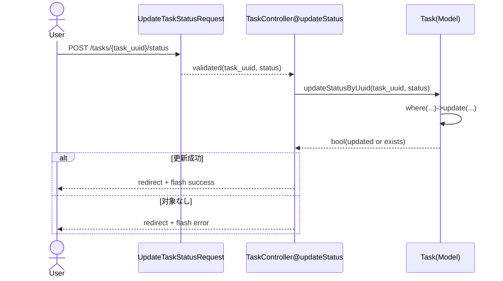
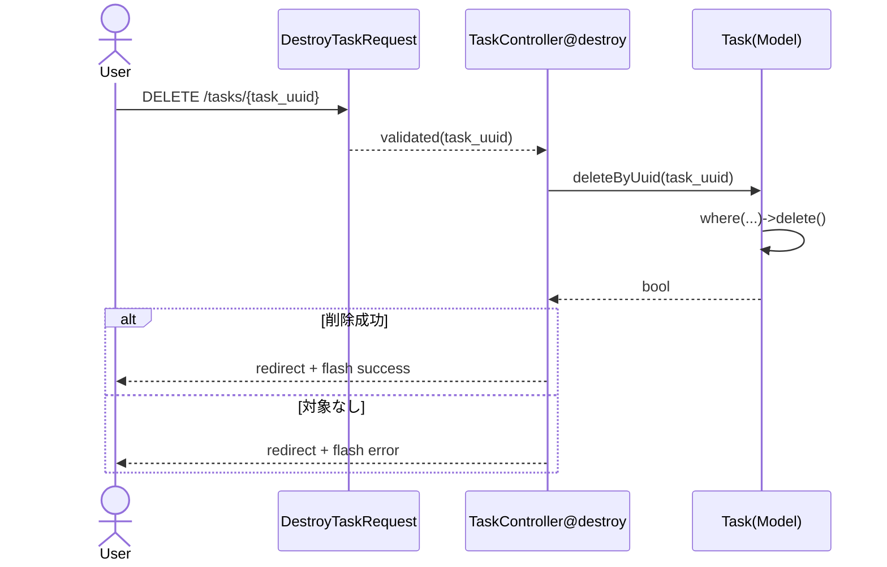

# Task機能 データフロー図（master / MVC版）

このドキュメントは、`master` ブランチの Task 機能におけるデータの流れを可視化するためのものです。  

---

## 1. 全体レイヤーフロー

補足:

- `master` では UseCase / Repository Interface / Presenter / ViewModel は導入していない
- `TaskController` が Model 呼び出しとレスポンス組み立てを直接担う

---

## 2. 一覧（GET `/`）

---

## 3. 作成（POST `/tasks`）

---

## 4. ステータス更新（POST `/tasks/{task_uuid}/status`）

---

## 5. 削除（DELETE `/tasks/{task_uuid}`）

